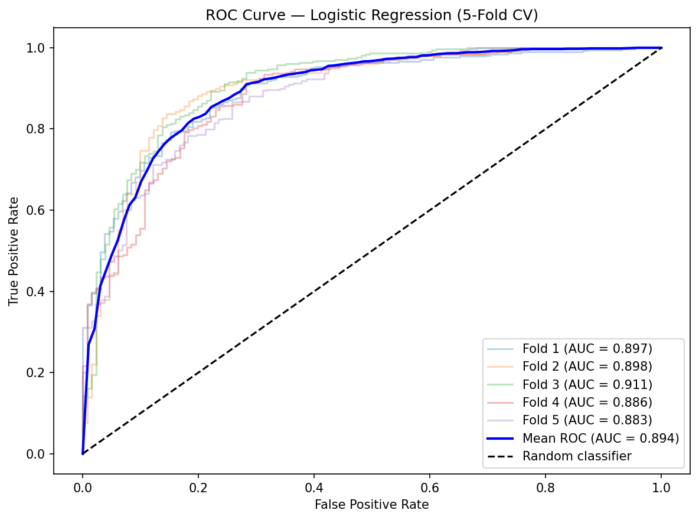
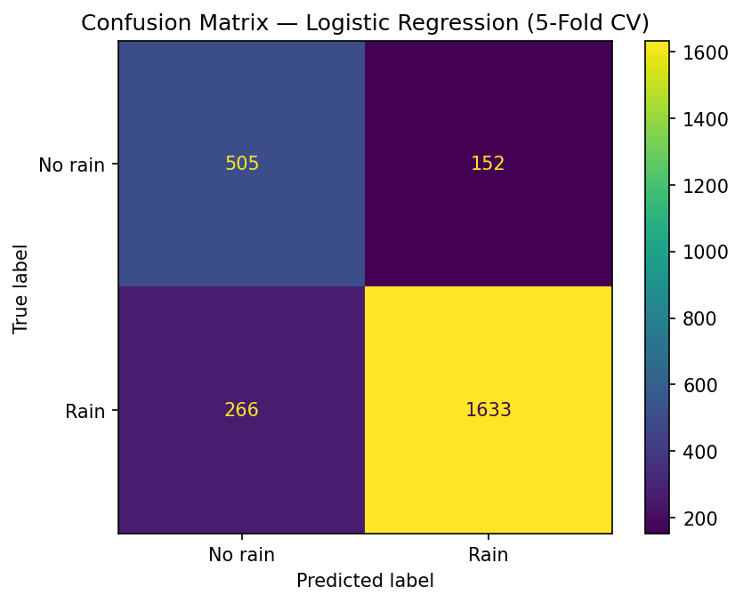
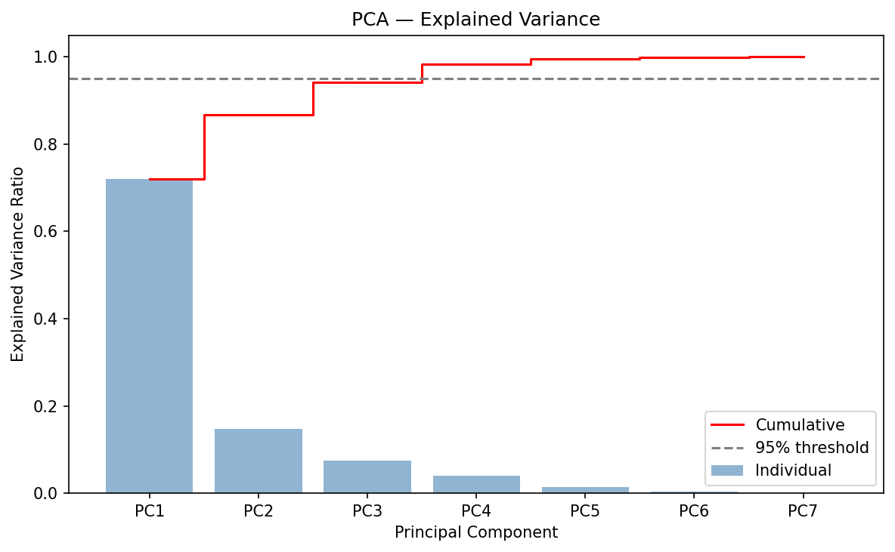
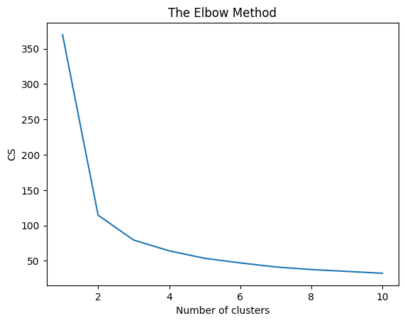
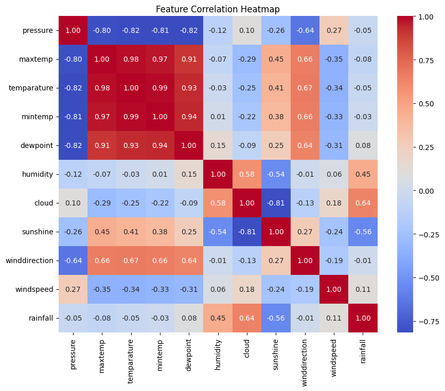

# 🌧️ Rainfall — Two-Year Rainfall Probability Forecast


> 🏆 My first Kaggle competition entry. Predicting daily rainfall probability using a KMeans + PCA + Logistic Regression pipeline.

---

## Overview

This project tackles binary rainfall prediction (rain / no rain) from daily meteorological data. The repository documents the full iterative development process — from a simple KMeans baseline to the final model, with an exploratory side-branch into time series decomposition that is kept in the archive for reference.

**Final approach:** cluster-based feature engineering (KMeans) combined with PCA dimensionality reduction, feeding into a tuned Logistic Regression classifier.

---

## Results

| Model | CV ROC-AUC |
|-------|-----------|
| RandomForest (baseline) | 0.878 |
| Logistic Regression | 0.894 |
| Logistic Regression + GridSearch (C=0.01, L2) | **0.894** |

Final model: Logistic Regression, tuned via `GridSearchCV` (C=0.01, L2 penalty, balanced class weights), evaluated with 5-fold stratified cross-validation.





---

## Visualisations








---

## Pipeline

```
Raw meteorological data
        │
        ▼
Data cleaning              ← merge train + original dataset, fillna, drop id/day
        │
        ▼
Feature scaling            ← MinMaxScaler (cloud, sunshine, humidity)
        │
        ▼
Clustering                 ← KMeans (k=2, elbow method) + centroid distance features
        │
        ▼
Dimensionality Reduction   ← PCA (StandardScaler + PCA on engineered features)
        │
        ▼
Classification             ← Logistic Regression, GridSearchCV tuning
        │
        ▼
Evaluation                 ← 5-fold stratified CV, ROC-AUC, confusion matrix
```

> ⚠️ **Note on data leakage:** an earlier version of this pipeline accidentally fit the `MinMaxScaler` and transformed the *training* data twice instead of transforming the held-out test data, which silently broke the KMeans cluster/centroid features for the test set. This has been fixed — `MinMaxScaler.transform()` is now correctly applied to the test split before clustering and PCA.

---

## Dataset

| Split | Description |
|-------|-------------|
| Train | Kaggle competition train set + original Rainfall dataset (merged) |
| Test | Kaggle competition test set |

**Features:** `pressure` · `maxtemp` · `temparature` · `mintemp` · `dewpoint` · `humidity` · `cloud` · `sunshine` · `winddirection` · `windspeed`

Source: Kaggle Rainfall Prediction competition.

---

## Tech Stack

| Category | Libraries |
|----------|-----------|
| ML & Preprocessing | scikit-learn (KMeans, PCA, StandardScaler, MinMaxScaler, LogisticRegression, GridSearchCV) |
| Data | Pandas, NumPy |
| Visualisation | Matplotlib, Seaborn |
| Environment | Jupyter Notebook / Google Colab |

---

## Repository Structure

```
Rainfall/
├── data/
│   ├── train.csv               # Kaggle training set
│   ├── test.csv                # Kaggle test set
│   └── Rainfall.csv            # Original supplementary dataset
├── notebooks/
│   ├── 05_final_model.ipynb    # Final model — KMeans + PCA + Logistic Regression
│   └── archive/                # Earlier experiments, kept for reference
│       ├── 01_kmeans_baseline.ipynb
│       ├── 02_kmeans_v2.ipynb
│       ├── 03_pca_initial.ipynb
│       ├── 04_rain_baseline.ipynb
│       ├── 05_kmeans_pca_combined.ipynb
│       ├── 06_pca_variance_analysis.ipynb
│       ├── 07_kmeans_pca_v2.ipynb
│       ├── 08_two_datasets_kmeans_pca.ipynb
│       ├── 09_two_datasets_kmeans_pca_v2.ipynb
│       ├── 10_timeseries_baseline.ipynb
│       ├── 11_timeseries_lag_features.ipynb
│       ├── 12_timeseries_2clusters_trend.ipynb
│       ├── 13_kmeans_pca_hyperparams.ipynb
│       ├── 14_timeseries_hybrid.ipynb        # exploratory: Fourier seasonality + lag features
│       └── 15_timeseries_2clusters.ipynb
├── reports/
│   └── figures/
│       ├── roc_curve.png
│       ├── confusion_matrix.png
│       ├── feature_importance.png
│       ├── pca_variance.png
│       ├── KMeans_elbow_chart.png
│       └── Correlation_Heatmap.png
└── README.md
```

> The `archive/` folder also includes a time-series exploration branch (Fourier seasonality, lag features, deseasonalization). It was not adopted for the final submission but is kept for reference and future iteration.

---

## Getting Started

```bash
git clone https://github.com/zikmundmartin7-lab/Rainfall.git
cd Rainfall
pip install scikit-learn pandas numpy matplotlib seaborn requests
```

Open the final notebook:

```bash
jupyter notebook notebooks/05_final_model.ipynb
```

---

## Author

**Martin Zikmund** — [zikmundmartin7@gmail.com](mailto:zikmundmartin7@gmail.com)

---

*First Kaggle competition entry. Built iteratively over ~3 weeks in September 2025.*
